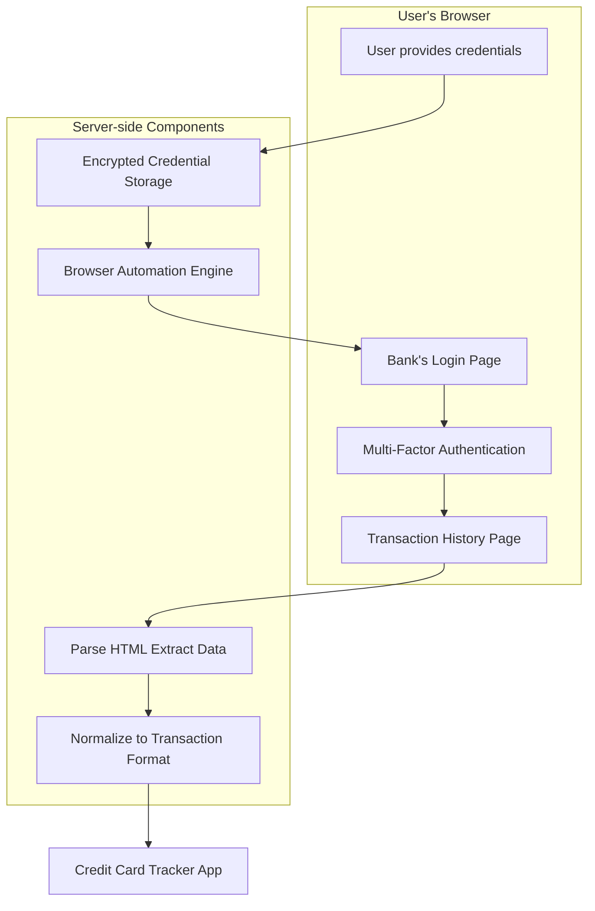
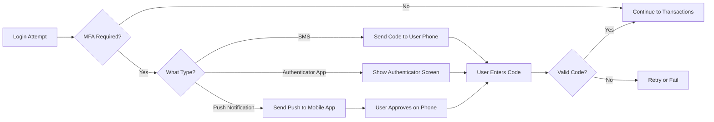
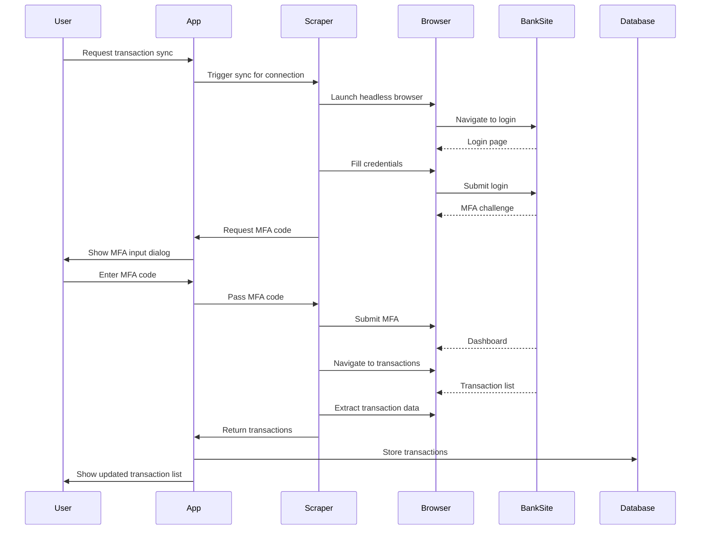

# Screen-Scraping Bank Websites: Architecture & Implementation Plan

## Overview

This document outlines how screen-scraping bank websites would work as an alternative to the Plaid API for your credit card tracker application.

## How Screen-Scraping Works for Bank Websites

### Core Concept

Instead of using an official API like Plaid, screen-scraping involves:
1. **Automating a web browser** to log into the user's bank website
2. **Navigating to transaction pages** programmatically
3. **Extracting data** from the HTML structure
4. **Storing and processing** the scraped data locally

### High-Level Architecture



## Comparison: Plaid vs. Screen-Scraping

### Plaid Advantages

| Aspect | Plaid |
|--------|-------|
| **Legal** | Official API, fully compliant with bank terms |
| **Stability** | Single integration works for 12,000+ institutions |
| **Security** | Bank-grade encryption, no credential handling |
| **Maintenance** | Automatic updates when banks change their systems |
| **Rate Limits** | Predictable API limits |
| **MFA Handling** | Built-in support for various MFA flows |

### Screen-Scraping Advantages

| Aspect | Screen-Scraping |
|--------|-----------------|
| **Cost** | Free - no per-user API fees |
| **Coverage** | Can work with any bank (even without official API) |
| **Data Access** | May access data not available through official APIs |
| **No Middleman** | Direct connection, no third-party dependency |
| **Customization** | Can extract any data visible on the website |

### Screen-Scraping Challenges

| Challenge | Impact |
|-----------|--------|
| **Legal/Terms of Service** | Banks often prohibit automated access; risk of account termination |
| **Brittle** | Any UI change breaks the scraper |
| **Maintenance Burden** | Each bank requires custom parser; updates after every redesign |
| **MFA Complexity** | Handling various MFA methods is difficult to automate |
| **CAPTCHAs** | Many banks use CAPTCHAs to prevent automation |
| **Security Risk** | Storing bank credentials is high-risk |
| **Rate Limiting** | Banks may block automated access patterns |
| **Session Management** | Sessions expire; need to re-authenticate |

## Technical Implementation Approach

### Architecture Components

```
src/
├── app/
│   └── api/
│       └── screen-scraping/
│           ├── connect/route.ts          # Start connection flow
│           ├── credentials/route.ts       # Secure credential storage
│           ├── sync/route.ts             # Trigger transaction sync
│           ├── status/route.ts            # Check connection status
│           └── disconnect/route.ts        # Remove credentials
├── lib/
│   ├── screen-scraping/
│   │   ├── browser.ts                    # Puppeteer/Playwright wrapper
│   │   ├── credentials.ts                # Encrypted credential storage
│   │   ├── banks/
│   │   │   ├── base-bank-scraper.ts      # Abstract base class
│   │   │   ├── chase-scraper.ts          # Chase-specific implementation
│   │   │   ├── amex-scraper.ts           # American Express specific
│   │   │   └── discover-scraper.ts       # Discover specific
│   │   ├── parsers/
│   │   │   ├── transaction-parser.ts     # Extract transactions from HTML
│   │   │   └── account-parser.ts         # Extract account info from HTML
│   │   └── mfa/
│   │       ├── sms-handler.ts            # Handle SMS OTP
│   │       ├── authenticator-app.ts      # Handle authenticator codes
│   │       └── push-notification.ts      # Handle push confirmations
│   └── prisma.ts                         # Database access
```

### Key Technology Choices

#### Browser Automation
- **Puppeteer** or **Playwright** for headless browser control
- Playwright recommended for better async support and cross-browser testing

#### Credential Storage
- **Encryption at rest** using AES-256
- Store in database with separate encryption key (not in code)
- Never log or expose credentials

#### Data Extraction
- **Cheerio** or **JSDOM** for HTML parsing
- CSS selectors to locate transaction elements
- Fallback selectors for resilience

### Example: Chase Scraper Implementation

```typescript
// lib/screen-scraping/banks/chase-scraper.ts
import { BaseBankScraper } from './base-bank-scraper';
import { Page } from 'playwright';

export class ChaseScraper extends BaseBankScraper {
  bankName = 'Chase';
  loginUrl = 'https://chase.com';
  
  async login(page: Page, credentials: BankCredentials): Promise<boolean> {
    await page.goto('https://chase.com');
    
    // Username
    await page.fill('#userId', credentials.username);
    await page.click('#logonbutton');
    
    // Password
    await page.fill('#password', credentials.password);
    await page.click('#logonbutton');
    
    // Handle MFA if required
    if (await this.isMfaRequired(page)) {
      await this.handleMfa(page, credentials.mfaMethod);
    }
    
    return this.isLoggedIn(page);
  }
  
  async navigateToTransactions(page: Page): Promise<void> {
    // Navigate to credit card transactions
    await page.click('a[href*="transactions"]');
    await page.waitForSelector('.transaction-list', { timeout: 10000 });
  }
  
  async extractTransactions(page: Page): Promise<Transaction[]> {
    const transactions = await page.$$eval(
      '.transaction-row',
      (rows) => rows.map(row => ({
        date: row.querySelector('.date')?.textContent,
        description: row.querySelector('.description')?.textContent,
        amount: row.querySelector('.amount')?.textContent,
        category: row.querySelector('.category')?.textContent,
      }))
    );
    return this.normalizeTransactions(transactions);
  }
  
  async getCreditCards(page: Page): Promise<CreditCard[]> {
    // Extract credit card accounts from the accounts page
    const cards = await page.$$eval(
      '.account-card[data-type="credit"]',
      (cards) => cards.map(card => ({
        last4: card.querySelector('.last4')?.textContent,
        balance: card.querySelector('.balance')?.textContent,
        limit: card.querySelector('.limit')?.textContent,
      }))
    );
    return cards;
  }
}
```

### MFA Handling Strategy

Screen-scraping requires special handling for multi-factor authentication:



**Approaches for MFA:**
1. **User-entered code** - Display a modal in your app for user to enter SMS/authenticator code
2. **Integration with SMS APIs** - Use Twilio to receive SMS codes (requires user's phone access)
3. **Push notification relay** - Complex; requires bank-specific integration

### Database Schema Updates

```prisma
model ScreenScrapingConnection {
  id              String   @id @default(cuid())
  userId          String
  user            User     @relation(fields: [userId], references: [id])
  
  bankName        String   // e.g., "Chase", "American Express"
  bankIdentifier  String   // Internal bank ID
  
  // Encrypted credentials
  encryptedCredentials String  // AES-encrypted JSON of username, password, etc.
  
  // Session state
  lastSyncAt     DateTime?
  syncStatus      String   // "active", "error", "mfa_required", "locked"
  errorMessage   String?
  
  // MFA state
  mfaMethod       String?  // "sms", "authenticator", "push"
  mfaVerifiedAt   DateTime?
  
  createdAt       DateTime @default(now())
  updatedAt       DateTime @updatedAt
  
  cards           Card[]
}
```

### Sync Flow



## Security Considerations

### Critical Security Requirements

1. **Credential Encryption**
   - Never store plaintext credentials
   - Use envelope encryption (key rotation support)
   - Separate encryption key from encrypted data

2. **Credential Transmission**
   - Use HTTPS for all communications
   - Zero-knowledge architecture (you can't read user's bank credentials)

3. **Access Controls**
   - User must explicitly consent to credential storage
   - Provide easy credential deletion

4. **Audit Logging**
   - Log all access to credentials
   - Log all transaction syncs

5. **Rate Limiting**
   - Prevent brute force attacks
   - Limit sync frequency

## Cost-Benefit Analysis

| Factor | Plaid | Screen-Scraping |
|--------|-------|-----------------|
| **Setup Cost** | Low - standard API integration | High - custom scrapers per bank |
| **Per-User Cost** | ~$0.25-2.00/month (varies) | Free (but high maintenance) |
| **Maintenance** | Low - Plaid handles bank changes | High - you maintain all scrapers |
| **Reliability** | High - official API | Variable - breaks on UI changes |
| **Legal Risk** | Low - sanctioned integration | High - may violate ToS |

## Recommendation

### When to Use Screen-Scraping

- **Free or very cheap credit monitoring** where Plaid costs are prohibitive
- **Specific use cases** where you need data not available through Plaid
- **Educational/hobby projects** where reliability is not critical
- **Banks not supported by Plaid** (rare, Plaid covers most US banks)

### When to Stick with Plaid

- **Production applications** requiring reliability
- **Commercial products** with revenue to support Plaid costs
- **Applications where ToS compliance is important**
- **When you need predictable, stable integrations**

### Hybrid Approach

Consider using Plaid as the primary integration and screen-scraping as a fallback for:
- Banks not supported by Plaid
- Users who prefer not to use Plaid for privacy reasons
- Specific data points not available through Plaid's API

## Implementation Priority

1. **Security Infrastructure**
   - Implement encrypted credential storage
   - Set up secure key management
   
2. **Scraper Framework**
   - Create base scraper class
   - Implement browser automation layer
   - Build transaction parser utilities

3. **Bank Integrations**
   - Start with one bank (e.g., Chase)
   - Add MFA handling
   - Test thoroughly before adding more

4. **User Experience**
   - Credential input flow
   - MFA code entry UI
   - Sync status indicators
   - Error handling and recovery

5. **Monitoring & Alerts**
   - Sync failure notifications
   - Bank website change detection
   - Credential expiration reminders

## Resources & References

### Tools
- **Playwright**: https://playwright.dev
- **Puppeteer**: https://pptr.dev
- **Cheerio**: https://cheerio.js.org
- **jsdom**: https://github.com/jsdom/jsdom

### Security
- **OWASP Credential Storage**: https://cheatsheetseries.owasp.org/cheatsheets/Credential_Stuffing_Prevention_Cheat_Sheet.html
- **AES Encryption in Node.js**: Node's built-in `crypto` module

### Legal Considerations
- Review each bank's Terms of Service before implementing
- Consider consulting legal counsel for production use
- Some banks explicitly prohibit automated account access

---

## Summary

Screen-scraping bank websites is technically feasible but comes with significant challenges around maintenance, security, and legal compliance. For a production credit card tracker, Plaid remains the recommended approach. If you proceed with screen-scraping, plan for:

- **High initial development effort** per bank
- **Ongoing maintenance** as banks update their websites
- **Robust security measures** for credential handling
- **Clear user communication** about the trade-offs

Would you like me to create a more detailed implementation plan for any specific aspect of screen-scraping, or would you prefer to continue with the current Plaid integration?